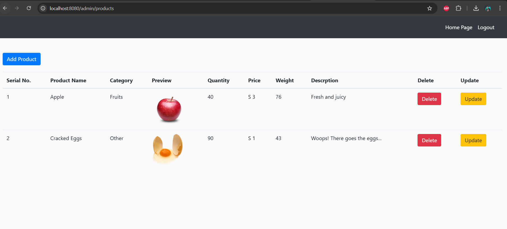

# SmartShop – E-Commerce Management System

## Overview
This project is a web-based application that includes user and admin functionalities. The admin panel allows management of customers, products, and categories, while users can browse and interact with the system.

## Features
- **Admin Dashboard:** Overview of system statistics.
- **Customer Management:** Admin can view and manage customer details.
- **Product Management:** Admin can add, edit, and remove products.
- **Category Management:** Admin can organize products into categories.
- **User Authentication:** Login system with validation and error handling.
- **User View:** Customers can browse available products.

## Screenshots
### Admin Panel
#### Admin Login


#### Admin Login Failed


#### Admin Dashboard


#### Customers Management


#### Products Management


#### Categories Management


### User View
#### Homepage


#### User View


#### Login Failed


## Installation
1. Clone the repository:
   ```sh
   git clone https://github.com/your-repo-name.git
   ```
2. Navigate to the project directory:
   ```sh
   cd project-directory
   ```
3. Install dependencies:
   ```sh
   npm install  # For frontend (if applicable)
   mvn clean install  # For Spring Boot backend
   ```
4. Configure the database:
   - Update database credentials in `application.properties` (Spring Boot)
   - Run database migrations if needed.

5. Start the application:
   ```sh
   npm start  # Start frontend
   mvn spring-boot:run  # Start backend
   ```

## Technologies Used

### Backend Technologies
✅ **Spring Boot** – For backend development and REST API services  
✅ **Spring Data JPA** – For database interactions using ORM  
✅ **Hibernate** – For efficient database management  
✅ **MySQL** – As the relational database for storing products, categories, users, and orders  

### Frontend Technologies
✅ **HTML, CSS, Bootstrap** – For responsive and user-friendly UI design  
✅ **JavaScript & jQuery** – For interactive frontend functionality  

### Database & Persistence
✅ **MySQL** – Structured data storage and management  
✅ **JPA/Hibernate** – ORM framework for efficient data handling  

### Additional Tools & Technologies
✅ **Spring Boot DevTools**-Provides hot-reloading for better development efficiency.

✅ **Maven** – For dependency management and project build  
✅ **Git & GitHub** – For version control and collaboration  
✅ **Postman** – For API testing  
## Contributing
Feel free to submit pull requests or open issues for improvements.
